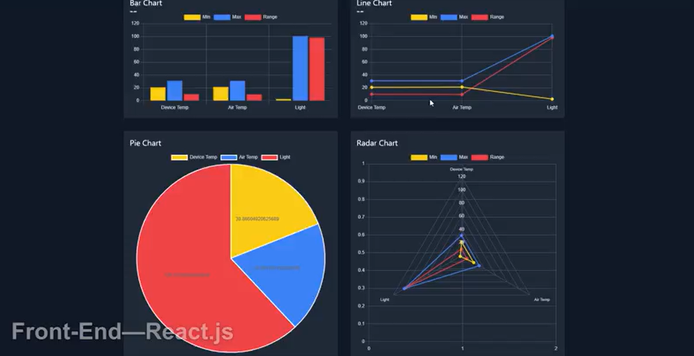

# IOT-Data-Visualizer
A real-time IoT dashboard built with React.js, Flask, and Chart.js to visualize sensor data from LabJack devices. 
Features include live data streaming, interactive charts, and responsive design.

---

## 🚀 Features
- Real-time data streaming using **Socket.IO**  
- Dynamic charts powered by **Chart.js**  
- Responsive dark-mode UI with **Tailwind CSS**  
- Data storage using **SQLite**  
- Performance tested with **Google Lighthouse** (Accessibility, SEO, and Performance)

---

## 🛠️ Tech Stack
- **Frontend:** React.js, Tailwind CSS, Chart.js  
- **Backend:** Flask, Socket.IO  
- **Database:** SQLite  
- **Hardware:** LabJack U3-HV sensors  

---

## 📸 Demo
  

---

## ⚙️ Installation & Setup
1. Clone the repo:
   ```bash
   git clone https://github.com/yourusername/labjack-dashboard.git
   cd labjack-dashboard

2. Install dependencies:

```bash
pnpm install    # frontend
pip install -r requirements.txt   # backend

```
3.Start the backend server:
```bash
python app.py
```
4. Start the frontend:
```bash
pnpm start
```